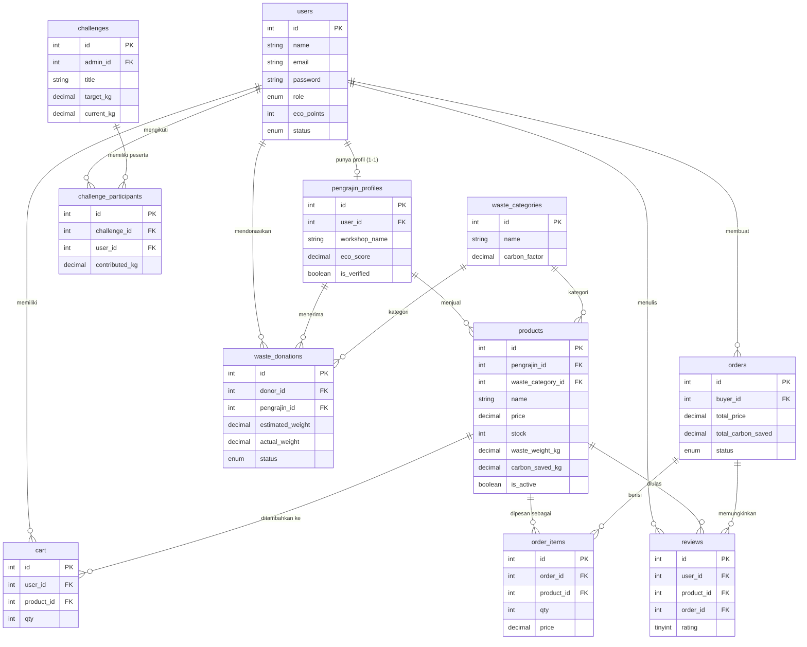

# EcoCraft Marketplace API (Backend)

Backend RESTful API untuk **Marketplace Produk Daur Ulang & Kerajinan Limbah** — mempertemukan pengrajin daur ulang dengan pembeli peduli lingkungan, dilengkapi fitur donasi limbah dan challenge daur ulang bulanan.

> **Status:** Backend selesai dibangun secara bertahap dan sudah diuji end-to-end (lihat bagian [Pengujian](#pengujian-yang-sudah-dilakukan)). Frontend belum dikerjakan — sesuai instruksi tugas, fokus backend dulu.

## Tech Stack
- Node.js + Express
- MySQL (`mysql2`, connection pool + promise pool untuk transaction)
- JWT untuk autentikasi (`jsonwebtoken`)
- `bcryptjs` untuk hash password
- ES Modules (`type: module`)

## Daftar Isi
- [Fitur per Role](#fitur-per-role)
- [ERD (Entity Relationship Diagram)](#erd)
- [Cara Menjalankan](#cara-menjalankan)
- [Environment Variables](#environment-variables)
- [Skema Otorisasi (Role & Ownership)](#skema-otorisasi)
- [Dokumentasi API Lengkap](#dokumentasi-api-lengkap)
- [Logika Eco Score & Kalkulasi CO2](#logika-eco-score--kalkulasi-co2)
- [Struktur Folder](#struktur-folder)
- [Pengujian yang Sudah Dilakukan](#pengujian-yang-sudah-dilakukan)
- [Panduan Deployment](#panduan-deployment)
- [Keterbatasan & Pengembangan Lanjutan](#keterbatasan--pengembangan-lanjutan)

---

## Fitur per Role

| Role | Bisa Apa Saja |
|---|---|
| **Guest** (belum login) | Browse produk, lihat detail produk, lihat review, lihat challenge |
| **Pembeli** | Semua hak guest + beli produk (cart, checkout), donasi limbah, ikut challenge, tulis review |
| **Pengrajin** | Semua hak pembeli + kelola produk sendiri (kalau sudah diverifikasi admin), konfirmasi donasi yang masuk, update status order yang berisi produknya |
| **Admin** | Verifikasi pengrajin, kelola challenge, suspend/hapus akun, lihat dashboard statistik, akses CRUD penuh ke semua resource |

---

## ERD



---

## Cara Menjalankan

1. Install dependencies
   ```bash
   npm install
   ```

2. Buat file `.env` dari contoh, sesuaikan kredensial MySQL kalian
   ```bash
   cp .env.example .env
   ```

3. Buat database & skema awal
   ```bash
   mysql -u root -p < init.sql
   ```
   Ini membuat database `ecocraft_db`, 11 tabel, seed 5 kategori limbah, dan 1 akun admin.

4. Jalankan server
   ```bash
   npm run dev      # mode development (auto-restart pakai nodemon)
   npm start        # mode production
   ```

5. Cek server hidup
   ```bash
   curl http://localhost:5000/
   ```
   Endpoint ini juga menampilkan daftar semua endpoint yang tersedia.

**Akun admin awal (dari seed):** `admin@ecocraft.com` / `admin123`

---

## Environment Variables

| Variabel | Keterangan |
|---|---|
| `PORT` | Port server (default 5000) |
| `DB_HOST`, `DB_USER`, `DB_PASSWORD`, `DB_NAME` | Kredensial MySQL |
| `JWT_SECRET` | String rahasia untuk sign JWT — **wajib diganti**, jangan dipakai apa adanya saat deploy |
| `JWT_EXPIRES_IN` | Masa berlaku token (default `1d`) |

---

## Skema Otorisasi

Semua endpoint yang butuh login memvalidasi JWT lewat `authMiddleware` (header `Authorization: Bearer <token>`). Setelah itu, dua lapis tambahan dipakai sesuai kebutuhan:

1. **Role check** (`roleMiddleware.js` / `authorize(...roles)`) — menentukan role apa saja yang boleh akses suatu endpoint.
2. **Ownership check** — memastikan resource yang diakses benar milik user yang login (bukan cuma rolenya cocok).

Ownership diterapkan dengan dua pola berbeda tergantung resource:
- **Produk**: middleware terpisah (`middlewares/productOwnership.js`) karena dipakai di 2 endpoint (PUT & DELETE) dengan logic identik.
- **Cart, Donasi, Order, Review, Challenge**: dicek inline di controller, karena aturan kepemilikan berbeda-beda per aksi (mis. donasi: donor boleh batalkan, tapi hanya pengrajin tujuan yang boleh konfirmasi).

| Resource | Aturan Ownership |
|---|---|
| Produk | Pengrajin hanya bisa ubah/hapus produk miliknya sendiri (dicek lewat `pengrajin_profiles.user_id`). Admin bebas akses semua. |
| Cart | Selalu milik diri sendiri — query selalu difilter `WHERE user_id = req.user.id`, tidak mungkin akses cart orang lain. |
| Donasi | Donor boleh lihat & batalkan donasinya sendiri. Hanya pengrajin tujuan donasi yang boleh konfirmasi/tolak. Admin lihat semua. |
| Order | Pembeli lihat & batalkan order miliknya. Pengrajin hanya bisa update status order yang **mengandung produknya**. Admin bebas akses semua. |
| Review | Hanya pemilik order yang **statusnya 'selesai'** dan **berisi produk tsb** yang boleh menulis ulasan (dicek via JOIN orders+order_items, bukan cuma role). Edit/hapus hanya pemilik ulasan (atau admin untuk hapus). |
| Challenge | Create/update/delete khusus admin. Update progres kontribusi hanya untuk partisipan itu sendiri. |

---

## Dokumentasi API Lengkap

Format response konsisten: `{ status: "success" | "fail" | "error", message?, data? }`
- `success` (2xx) — berhasil
- `fail` (4xx) — kesalahan dari sisi client (validasi, auth, ownership)
- `error` (5xx) — kesalahan server

### Auth (`/api/auth`)
| Method | Endpoint | Auth | Body / Query | Keterangan |
|---|---|---|---|---|
| POST | `/register` | - | `name, email, password, role?, workshop_name?, description?` | `role` default `pembeli`. Kalau `pengrajin`, `workshop_name` wajib. |
| POST | `/login` | - | `email, password` | Mengembalikan JWT token |
| GET | `/me` | Bearer | - | Profil sendiri (pengrajin dapat tambahan data workshop & eco score) |

### Produk (`/api/products`)
| Method | Endpoint | Auth | Keterangan |
|---|---|---|---|
| GET | `/?name=&waste_category=&pengrajin_id=&page=&limit=` | - | List produk aktif, publik |
| GET | `/:id` | - | Detail produk + info pengrajin + carbon factor |
| POST | `/` | pengrajin (terverifikasi) | Tambah produk, `carbon_saved_kg` & eco score dihitung otomatis |
| PUT | `/:id` | owner pengrajin / admin | Update produk |
| DELETE | `/:id` | owner pengrajin / admin | Hapus produk. **Soft delete otomatis** (set `is_active=false`) kalau produk sudah punya riwayat order |

### Donasi Limbah (`/api/donations`) — semua butuh login
| Method | Endpoint | Keterangan |
|---|---|---|
| GET | `/?status=&page=&limit=` | List donasi (admin: semua, pengrajin: yang masuk ke dia, donor: miliknya) |
| GET | `/:id` | Detail (hanya donor/pengrajin terkait/admin) |
| POST | `/` | Buat request donasi: `pengrajin_id, waste_category_id, estimated_weight, notes?` |
| PUT | `/:id/confirm` | Pengrajin tujuan: `status: dikonfirmasi\|diterima\|ditolak`, `actual_weight` wajib saat `diterima` (trigger Eco Points donor + Eco Score pengrajin) |
| DELETE | `/:id` | Donor batalkan (hanya selama status `menunggu`) |

### Cart (`/api/cart`) — semua butuh login, selalu milik sendiri
| Method | Endpoint | Keterangan |
|---|---|---|
| GET | `/` | Isi keranjang + total harga |
| POST | `/` | Tambah: `product_id, qty?` (qty otomatis ditambahkan kalau produk sudah ada di cart) |
| PUT | `/:id` | Update qty item cart |
| DELETE | `/:id` | Hapus item dari cart |

### Order (`/api/orders`) — semua butuh login
| Method | Endpoint | Role | Keterangan |
|---|---|---|---|
| POST | `/` | pembeli | **Checkout** dari cart (pakai DB transaction): hitung total, kurangi stok, kosongkan cart — semua atomik |
| GET | `/?status=&page=&limit=` | semua | List order (admin: semua, pembeli: miliknya, pengrajin: yang ada produknya) |
| GET | `/:id` | semua | Detail order + items |
| PUT | `/:id/status` | pengrajin terkait / admin | `status: dikemas\|dikirim\|selesai\|dibatalkan`. Saat `selesai`, Eco Points pembeli otomatis bertambah |
| DELETE | `/:id` | pembeli pemilik / admin | Batalkan (hanya saat `pending`), stok dikembalikan otomatis |

### Challenge (`/api/challenges`)
| Method | Endpoint | Auth | Keterangan |
|---|---|---|---|
| GET | `/?status=&page=&limit=` | - | List challenge, publik |
| GET | `/:id` | - | Detail + leaderboard peserta (urut kontribusi terbanyak) |
| POST | `/` | admin | Buat challenge baru |
| PUT | `/:id` | admin | Update challenge |
| DELETE | `/:id` | admin | Hapus challenge |
| POST | `/:id/join` | login | Ikut challenge (satu user hanya bisa join sekali) |
| PUT | `/:id/progress` | login (partisipan) | Update `contributed_kg` & `proof_image`. `current_kg` challenge otomatis ter-update (SUM semua kontribusi) |

### Review (`/api/reviews`)
| Method | Endpoint | Auth | Keterangan |
|---|---|---|---|
| GET | `/?product_id=&page=&limit=` | - | List review, publik |
| GET | `/:id` | - | Detail review |
| POST | `/` | pembeli | Wajib `product_id, order_id, rating(1-5), comment?` — order harus berstatus `selesai` dan mengandung produk tsb |
| PUT | `/:id` | owner | Edit (maks 7 hari sejak dibuat) |
| DELETE | `/:id` | owner / admin | Hapus |

### Admin (`/api/admin`) — semua butuh role admin
| Method | Endpoint | Keterangan |
|---|---|---|
| GET | `/pengrajin?verified=true\|false` | List pengrajin (untuk review verifikasi) |
| PUT | `/pengrajin/:id/verify` | Verifikasi akun pengrajin (baru bisa upload produk setelah ini) |
| PATCH | `/users/:id/status` | Suspend/aktifkan akun (`status: active\|suspended`) |
| DELETE | `/users/:id` | Hapus akun |
| GET | `/stats` | Dashboard: total user per role, total produk aktif, total transaksi & omzet, total CO2 dihemat, total limbah terolah (dari produk + donasi), donasi pending, challenge aktif |

---

## Logika Eco Score & Kalkulasi CO2

```
carbon_saved_kg (per produk) = waste_weight_kg × carbon_factor (dari waste_categories)

eco_score pengrajin = SUM(waste_weight_kg) dari semua produknya
                     + SUM(actual_weight) dari semua donasi berstatus 'diterima'
```
Dihitung ulang otomatis (`utils/ecoScore.js`) setiap kali: produk dibuat/diubah/dihapus, atau donasi dikonfirmasi diterima.

**Eco Points** (reward untuk pembeli/donor):
- Checkout selesai → `+round(total_carbon_saved × 2)` poin
- Donasi diterima → `+round(actual_weight × 10)` poin

Konstanta ini didefinisikan di awal `orderController.js` dan `donationController.js`, mudah disesuaikan.

---

## Struktur Folder
```
ecocraft-api/
├── config/
│   └── database.js          # koneksi MySQL (pool callback + promise pool untuk transaction)
├── controllers/
│   ├── homeController.js
│   ├── authController.js
│   ├── productController.js
│   ├── donationController.js
│   ├── cartController.js
│   ├── orderController.js     # pakai transaction untuk checkout
│   ├── challengeController.js
│   ├── reviewController.js
│   └── adminController.js
├── routes/
│   └── (1 file per resource, sama namanya dengan controller)
├── middlewares/
│   ├── errorHandler.js        # error handler global
│   ├── authMiddleware.js      # validasi JWT
│   ├── roleMiddleware.js      # authorize(...roles)
│   └── productOwnership.js    # ownership khusus produk
├── utils/
│   ├── jwt.js
│   └── ecoScore.js             # kalkulasi carbon & eco score
├── init.sql                    # skema 11 tabel + seed data
├── index.js                    # entry point, semua route terpasang di sini
├── .env.example
└── package.json
```

---

## Pengujian yang Sudah Dilakukan

Semua flow di bawah sudah diuji langsung (bukan cuma cek syntax) dengan MariaDB lokal + curl, mencakup skenario sukses **dan** skenario gagal yang seharusnya ditolak:

- Register (pembeli/pengrajin), validasi field wajib, email duplikat
- Login (benar/salah password), akun suspended ditolak login
- Protected route ditolak tanpa token / token tidak valid
- Pengrajin belum diverifikasi **tidak bisa** upload produk (403)
- Ownership produk: pengrajin lain **tidak bisa** edit produk orang lain (403), admin bisa, owner bisa
- Eco score pengrajin naik otomatis saat produk dibuat, turun saat produk dihapus
- Checkout: transaction atomik (stok berkurang, cart kosong, semua-atau-tidak-sama-sekali)
- Update status order hanya oleh pengrajin yang produknya ada di order tsb
- Eco points pembeli bertambah otomatis saat order `selesai`
- Order `selesai`/`dibatalkan` tidak bisa diubah lagi (409)
- Pembatalan order mengembalikan stok
- **Soft delete otomatis**: produk yang sudah punya riwayat order tidak bisa dihapus permanen → otomatis dinonaktifkan
- Review: hanya bisa mengulas produk dari order sendiri yang sudah selesai (dicek by SQL JOIN, bukan cuma role) — dicoba oleh user yang berbeda role maupun role yang sama tapi tidak punya order, dua-duanya ditolak
- Review duplikat untuk order+produk yang sama ditolak (409)
- Donasi: hanya pengrajin tujuan yang bisa konfirmasi; eco points & eco score ter-update saat diterima
- Challenge: hanya admin bisa buat; join dua kali ditolak (409); progress & leaderboard ter-update otomatis
- Filter berbasis role pada listing (donasi, order) — tiap role hanya melihat data yang relevan untuknya
- Admin: suspend akun (tidak bisa suspend diri sendiri), dashboard statistik

---

## Panduan Deployment

Pilih salah satu (Render/Railway termudah untuk pemula):

### Render / Railway
1. Push project ini ke GitHub repo
2. Buat **Web Service** baru, connect ke repo tsb
3. Build command: `npm install` — Start command: `npm start`
4. Tambahkan environment variables sesuai `.env.example` di dashboard
5. Tambahkan **MySQL database** add-on (Railway punya MySQL plugin bawaan; di Render pakai layanan eksternal seperti PlanetScale/Railway/Aiven, lalu masukkan kredensialnya ke env vars)
6. Jalankan `init.sql` ke database production (lewat MySQL client atau dashboard provider)
7. Deploy, lalu tes endpoint `/` untuk pastikan hidup

### Catatan penting sebelum deploy
- **Ganti `JWT_SECRET`** dengan string acak yang panjang & rahasia (jangan pakai contoh di `.env.example`)
- Jangan commit file `.env` ke git (`.gitignore` sudah menghandle ini)
- Set `NODE_ENV=production` kalau provider membutuhkannya

---

## Keterbatasan & Pengembangan Lanjutan

Hal-hal yang belum diimplementasikan karena di luar prioritas tahap ini, bisa ditambahkan kalau ada waktu:
- **Upload file beneran** (foto produk, bukti KTP, bukti challenge) — saat ini field `image`/`proof_image`/`ktp_photo` hanya menerima string URL. Untuk upload file asli, tambahkan `multer` sebagai middleware.
- **Validasi format input** masih manual per field (cek `if (!field)`), belum pakai library seperti `express-validator`. Untuk proyek lebih besar, ini bisa dirapikan jadi middleware validasi terpusat.
- **Rate limiting** belum ada (relevan kalau mau lebih tahan terhadap abuse di production).
- **Lupa password / reset password** belum ada flow-nya.
- Frontend — sengaja belum dikerjakan sesuai instruksi tugas.
